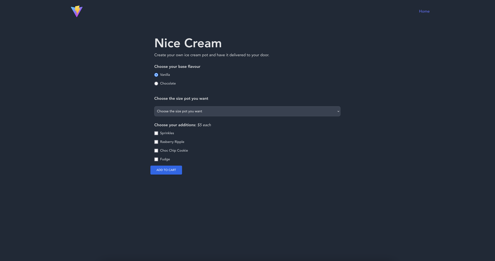
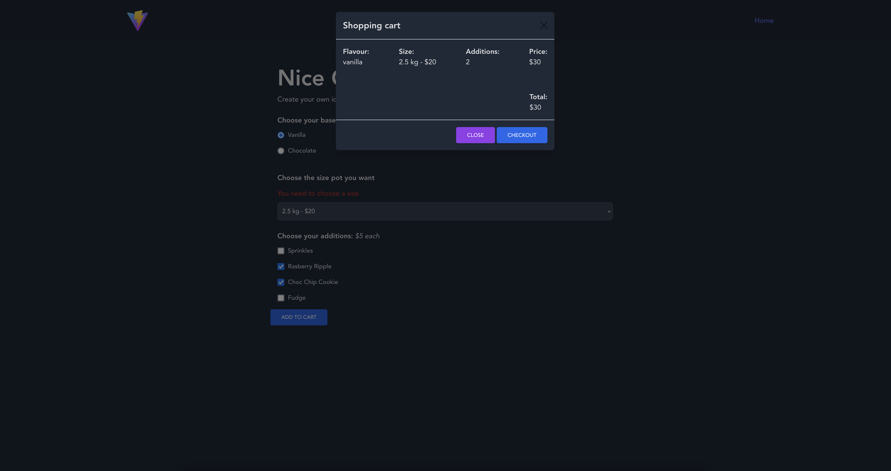
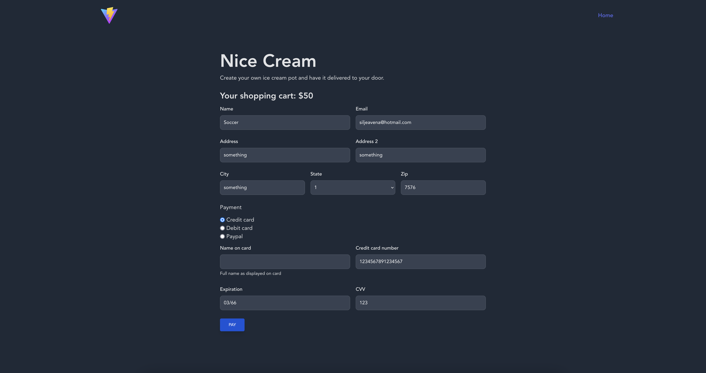

# Vite Project CA JS2

**Student:** [Silje Angelvik](https://github.com/siljeangelvik)    
**Host:** [Netlify](https://vite-project-ca-js2.netlify.app/)  
**Repository:** [GitHub](https://github.com/siljeangelvik/vite-project-ca-js2)

## Nice Cream

 <br/>  
 

## Description

The project is a web application for a fictional ice cream shop called Nice Cream. 

The web application is a single page application (SPA) that uses JavaScript to dynamically load content.

## Built with

- [HTML](https://developer.mozilla.org/en-US/docs/Web/HTML)
- [CSS](https://developer.mozilla.org/en-US/docs/Web/CSS)
- [JavaScript](https://developer.mozilla.org/en-US/docs/Web/JavaScript)
- [PostCSS](https://postcss.org/)
- [Git](https://training.github.com/downloads/github-git-cheat-sheet/)
- [GitHub](https://github.com/about)
- [Vite](https://vitejs.dev/)
- [Netlify](https://www.netlify.com/)
- [PhpStorm](https://www.jetbrains.com/phpstorm/)

## Getting started

### Installing

1. Clone the repo:

```bash
git clone git@github.com:siljeangelvik/vite-project-ca-js2.git
```

2. Install the dependencies:

```
npm install
```

### Running

To run the app in development mode:

```bash
npm run dev
```

To build the app:

```bash
npm run build
```

To preview the app:

```bash
npm run preview
```

## Contact

Click on the badges below to go to my profiles or contact me via email.

<a href = "https://www.linkedin.com/in/siljeangelvik/">
    
</a>
<a href = "https://github.com/siljeangelvik">
    
</a>
<a href = "mailto: angelviksilje@gmail.com">
    
</a>